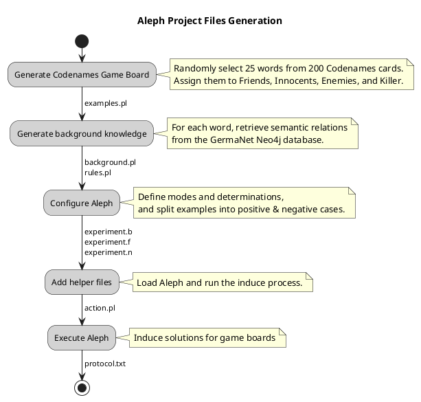

# Aleph Plays Codenames – Experiment Generator

This repository contains the source code used to generate the experiment setup for the publication:

**_Aleph Plays Codenames: Flexible Semantic Grouping by Humans, LLMs, and ILP_**

All processing is controlled via the [Invoke](https://www.pyinvoke.org) task framework. Three experiment configurations can be generated, and a special `all` task executes everything in the correct order.

> ⚠️ **Note:** Due to licensing restrictions the GermaNet database is **not included** in this repository. A licence can be obtained free of charge for scientific purposes from [GermaNet](https://uni-tuebingen.de/fakultaeten/philosophische-fakultaet/fachbereiche/neuphilologie/seminar-fuer-sprachwissenschaft/arbeitsbereiche/allg-sprachwissenschaft-computerlinguistik/ressourcen/lexica/germanet-1/lizenzen/).

---

## Quickstart

```bash
# 1) Clone
git clone <YOUR-REPO-URL>
cd ilp-codenames-publication-generator

# 2) Python env + deps
python3 -m venv .venv
source .venv/bin/activate
pip install -r requirements.txt

# 3) Start Neo4j with GermaNet (local helper)
# REQUIRES that you imported GermaNet into the docker volume
docker compose up -d   # uses docker-compose.yml in this repo


# 5) Generate experiments (all configs)
inv all            # == reset + normal + combined + allow-noise + induce
# or step-by-step:
# inv normal combined allow-noise
# inv induce

# 6) Results
# Workspaces are created under aleph_plays_codenames/<configuration>/<seed>/
# Each seed folder contains a standalone Aleph project and protocol/error outputs
```

If necessary, you can change the configuration in `invoke.yaml`.


---

## Getting Started (Details)

### Requirements
- Python **3.8+**
- A running **Neo4j** with the GermaNet graph
- Dependencies installed via `pip install -r requirements.txt`

### Neo4j + GermaNet
A Neo4j graph containing GermaNet semantic relationships is required to generate ILP background knowledge. You can create the database with:

- **germanet2neo** → https://github.com/almasch/GermaNet-2-Neo

A `docker-compose.yml` is provided for convenience.

---

## Experiment Configurations

| Task | Description | Label in paper |
|------|-------------|----------------|
| `inv normal` | Separate predicates per concept type | **Aleph1** |
| `inv combined` | All concept types merged into a single predicate | **Aleph2** |
| `inv allow-noise` | Like Aleph1, but innocents may appear as hints | **Aleph3** |

Each configuration contains **15 game boards** (one per random seed).

---

## Game Board Structure

Each seed folder is a standalone **Aleph** project:

```
seed/
├── experiment.b         # Aleph configuration 
├── experiment.f         # positive examples
├── experiment.n         # negative examples
├── background.pl        # background knowledge from GermaNet
├── examples.pl          # Prolog encoded game board
├── examples.txt         # Human-readable words used on the board
├── rules.pl             # Transitive relationships in background knowledge
└── action.pl            # Prolog script to run Aleph induce
```

---

## Activity Diagram – Workspace Creation



---

## Invoke Tasks (Short)

- `inv all` – Reset, generate all configs, run induction (end‑to‑end)
- `inv normal` – Generate **Aleph1** workspaces
- `inv combined` – Generate **Aleph2** workspaces
- `inv allow-noise` – Generate **Aleph3** workspaces
- `inv induce` – Run `action.pl` for every seed and write protocol.txt
- `inv clean` – Remove `protocol.txt`/`error.txt` files
- `inv reset` – Delete the entire workspace folder (`aleph_plays_codenames`)

---

## Repository Structure

The repository is organized into several key directories:

```
assets/
├── seeds.txt       Used random seeds to reproduce the generated game boards. 
└── words.txt       List of 200 Codenames words used in the game board generation.
aleph               Core Aleph system files and configurations templates.
common              Shared utility code and helper functions.
task_modules        Code for individual Invoke tasks.

```
Each module is designed to be self-contained while allowing for code reuse through the common package.

## Troubleshooting

**Error:** `Directory 'aleph_plays_codenames' does not exist`

- Generate the workspaces first: `invoke clean normal combined allow-noise` **or** just `inv all`.

**Neo4j/GermaNet issues**
- Ensure Neo4j is running and populated via **germanet2neo**.
- Verify the URL in `invoke.yaml`.

---

## License

This project is licensed under the terms of the [Apache License Version 2.0](LICENSE).